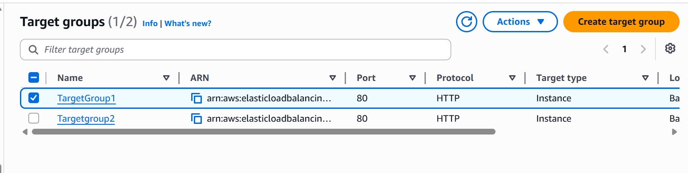
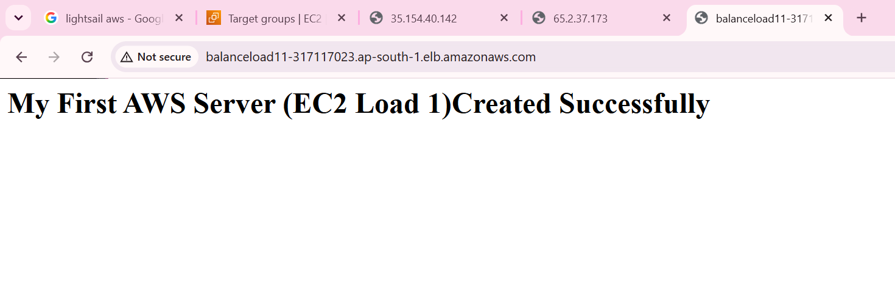
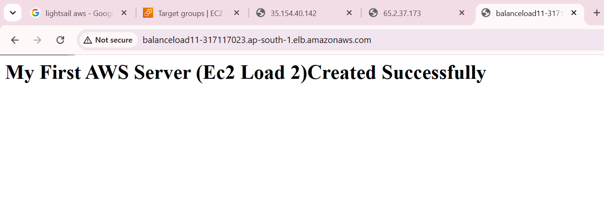

# AWS EC2 Load Balancer Project

## Project Overview

This project demonstrates how to build a highly available web application infrastructure using AWS EC2 instances and Application Load Balancer.

The objective was to distribute incoming traffic across multiple EC2 instances and understand how load balancing works in AWS.

---

## Architecture

User Request

↓

Application Load Balancer

↓

EC2 Instance 1 -------- EC2 Instance 2


---

## AWS Services Used

- Amazon EC2
- Application Load Balancer (ALB)
- Target Groups
- Security Groups
- Apache Web Server
- Amazon VPC

---

## Project Implementation

### Step 1: Created Two EC2 Instances

Created two Linux EC2 instances.

Installed Apache Web Server.

Commands used:

```bash
sudo yum update -y

sudo yum install httpd -y

sudo systemctl start httpd

sudo systemctl enable httpd
```

### Step 2: Configured Custom Web Pages

Instance 1:

```
My First AWS Server (EC2 Load 1)
```

Instance 2:

```
My First AWS Server (EC2 Load 2)
```

### Step 3: Created Target Groups

- Created separate target groups
- Added EC2 instances to target groups
- Configured health checks

### Step 4: Created Application Load Balancer

- Configured listener on Port 80
- Attached target groups
- Enabled traffic distribution

### Step 5: Testing

- Accessed Load Balancer DNS URL
- Refreshed browser multiple times
- Verified traffic distribution between instances

---

## Project Screenshots

### EC2 Instances


### Target Groups



### Load Balancer Routing To Instance 1



### Load Balancer Routing To Instance 2



---

## Key Learnings

✓ EC2 provisioning

✓ Apache installation

✓ Target Group configuration

✓ Load Balancer setup

✓ Traffic distribution

✓ High Availability concepts

✓ Health Checks

---

## Future Improvements

- Add Auto Scaling Group

- Configure HTTPS

- Add Route 53 Domain

- Use Terraform for Infrastructure as Code

---

## Author

Created as part of AWS Cloud learning journey.
